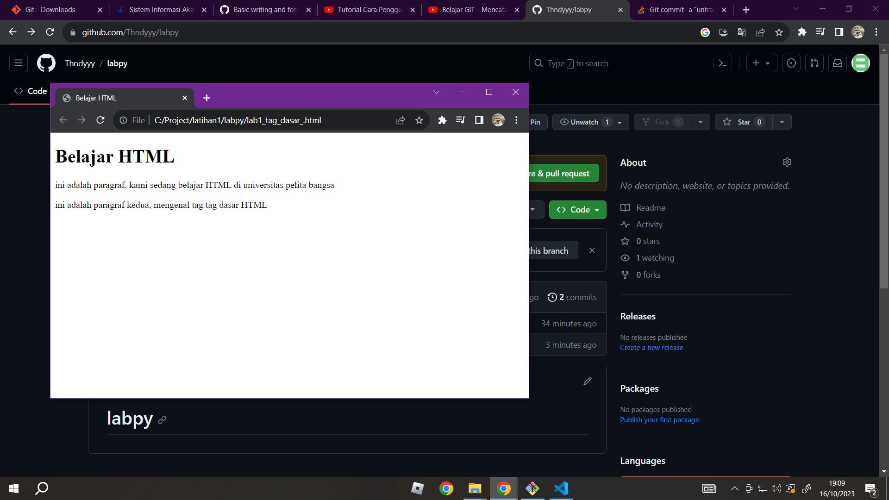

# Hi Saya Thondy Autarliandi
## Berikut ialah hasil belajar saya dalam mempelajari tag dasar HTML

### Membuat paragraf
kode tag untuk paragraf adalah 'p'
####Berikut ialah tampilan HTML polos tanpa menggunakan bahasa pemograman css

